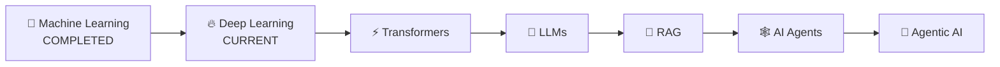

<!-- ===================== FUTURISTIC AI PROFILE ===================== -->

<div align="center">


<br>


<br><br>

<a href="https://linkedin.com/in/ayush-ahirrao-548942369/">

</a>
<a href="https://instagram.com/ayush._.ahirrao_23">

</a>
<a href="https://x.com/ahirrao6113">

</a>
<a href="mailto:ayushahirrao4@gmail.com">

</a>

<br><br>


</div>

---

```text
 █████╗ ██╗   ██╗██╗   ██╗███████╗██╗  ██╗
██╔══██╗╚██╗ ██╔╝██║   ██║██╔════╝██║  ██║
███████║ ╚████╔╝ ██║   ██║███████╗███████║
██╔══██║  ╚██╔╝  ██║   ██║╚════██║██╔══██║
██║  ██║   ██║   ╚██████╔╝███████║██║  ██║
╚═╝  ╚═╝   ╚═╝    ╚═════╝ ╚══════╝╚═╝  ╚═╝

        A I   •   M L   •   D E E P   L E A R N I N G
```

## `> SYSTEM.IDENTITY`

```python
class AIEngineerInProgress:

    def __init__(self):
        self.name = "Ayush Ahirrao"
        self.education = "Diploma in Artificial Intelligence"
        self.role = "AI / ML Developer"
        self.location = "India 🇮🇳"

        self.core = {
            "Machine Learning": "BUILDING ⚡",
            "Deep Learning": "TRAINING 🧠",
            "Generative AI": "UP NEXT 🔮",
            "Agentic AI": "DESTINATION 🚀"
        }

    def current_mission(self):
        return [
            "Master Deep Learning",
            "Build real-world AI systems",
            "Understand Transformers & LLMs",
            "Build RAG applications",
            "Engineer autonomous AI agents"
        ]

    def status(self):
        return "Constantly Learning..."
```

---

<div align="center">

# 🧠 `NEURAL PATHWAY`

### My journey toward intelligent systems

<br>

```text
╭──────────────╮
│    PYTHON    │
╰──────┬───────╯
       ↓
╭──────────────╮
│ DATA SCIENCE │
╰──────┬───────╯
       ↓
╭──────────────╮
│      ML      │  ████████████████████  ✓
╰──────┬───────╯
       ↓
╭──────────────╮
│ DEEP LEARNING│  ███████████████░░░░░  ◉
╰──────┬───────╯
       ↓
╭──────────────╮
│ TRANSFORMERS │  ░░░░░░░░░░░░░░░░░░░  ◌
╰──────┬───────╯
       ↓
╭──────────────╮
│     LLMs     │  ░░░░░░░░░░░░░░░░░░░  ◌
╰──────┬───────╯
       ↓
╭──────────────╮
│     RAG      │  ░░░░░░░░░░░░░░░░░░░  ◌
╰──────┬───────╯
       ↓
╭──────────────╮
│  AGENTIC AI  │  🚀 FINAL DESTINATION
╰──────────────╯
```

</div>

---

# ⚡ `CURRENT_PROCESS`

<table>
<tr>

<td width="33%" align="center">

### 🧠 LEARNING

`Deep Learning`

`Neural Networks`

`TensorFlow`

`PyTorch`

</td>

<td width="33%" align="center">

### 🔨 BUILDING

`ML Systems`

`AI Applications`

`Backend APIs`

`Neural Networks`

</td>

<td width="33%" align="center">

### 🔮 NEXT

`Transformers`

`LLMs`

`RAG`

`AI Agents`

</td>

</tr>
</table>

---

# 🚀 `PROJECT.EXE`

<div align="center">

### ⚡ Things I've actually built — not tutorial graveyards.

</div>

<table>

<tr>

<td width="50%" valign="top" align="center">

<h2>🚦 SMART ACCIDENT RISK PREDICTOR</h2>

<code>ML RISK PREDICTION SYSTEM</code>

<br><br>

Machine-learning project for predicting <b>accident risk/severity</b> from road and environmental conditions.

<br><br>

<b>PROJECT LINK</b>

<br><br>

<a href="https://github.com/ayushahirrao2007/Smart_Accident_Risk_Predictor">
🔗 <b>View Repository</b>
</a>

<br><br>

</td>

<td width="50%" valign="top" align="center">

<h2>📉 STARTUP FAILURE PREDICTION</h2>

<code>ML RISK PREDICTION ENGINE</code>

<br><br>

Machine-learning system for predicting <b>startup failure and shutdown risk</b> using startup and founder indicators.

<br><br>

<b>PROJECT LINK</b>

<br><br>

<a href="https://github.com/ayushahirrao2007/Startup-Failure_prediction">
🔗 <b>View Repository</b>
</a>

<br><br>

</td>

</tr>

<tr>

<td width="50%" valign="top" align="center">

<h2>⛽ FUELSYNC</h2>

<code>SMART LOCATION SYSTEM</code>

<br><br>

A smart application for discovering nearby <b>Petrol, CNG & EV charging stations</b> using real-world location data.

<br><br>

<b>PROJECT LINK</b>

<br><br>

<a href="https://github.com/ayushahirrao2007/FuelSync">
🔗 <b>View Repository</b>
</a>

<br><br>

</td>

<td width="50%" valign="top" align="center">

<h2>🧠 STROKE WEBSITE</h2>

<code>STROKE AWARENESS PLATFORM</code>

<br><br>

An educational web platform focused on <b>stroke awareness, learning resources, and therapeutics information</b>.

<br><br>

<b>PROJECT LINK</b>

<br><br>

<a href="https://github.com/ayushahirrao2007/Stroke_WebsiteMain">
🔗 <b>View Repository</b>
</a>

<br><br>

</td>

</tr>

</table>

---

# 🧰 `TECH.ARSENAL`

<div align="center">

### `{ LANGUAGES }`


<br><br>

### `{ AI / DEEP LEARNING }`


<br>


<br><br>

### `{ BACKEND / DATA }`


<br><br>

### `{ CLOUD }`


<br><br>

### `{ DEV TOOLS }`


</div>

---

# 🧠 `KNOWLEDGE.MAP`

```text
╔══════════════════════════════════════════════════════════╗
║                  AYUSH // AI MATRIX                     ║
╠══════════════════════════════════════════════════════════╣
║                                                        ║
║  Python              ███████████████████░   ACTIVE     ║
║  Machine Learning    ██████████████████░░   ACTIVE     ║
║  Scikit-Learn        █████████████████░░░   ACTIVE     ║
║                                                        ║
║  Deep Learning       ██████████████░░░░░░   LEARNING   ║
║  TensorFlow          █████████████░░░░░░░   LEARNING   ║
║  PyTorch             ███████████░░░░░░░░░   LEARNING   ║
║                                                        ║
║  Transformers        ████░░░░░░░░░░░░░░░░   QUEUED     ║
║  LLM Engineering     ███░░░░░░░░░░░░░░░░░   QUEUED     ║
║  RAG                 ██░░░░░░░░░░░░░░░░░░   QUEUED     ║
║  Agentic AI          ██░░░░░░░░░░░░░░░░░░   TARGET     ║
║                                                        ║
╚══════════════════════════════════════════════════════════╝
```

---

# 📡 `GITHUB.TELEMETRY`

<div align="center">


<br><br>


</div>

---

# 🌌 `CONTRIBUTION.UNIVERSE`

<div align="center">


</div>

---

# 🏆 `ACHIEVEMENTS.UNLOCKED`

<div align="center">


</div>

---

# 🛰️ `MISSION.ROADMAP`



---

# 💭 `PHILOSOPHY.LOG`

<div align="center">

```text
> WHY_AI.txt

I don't want to simply call an AI API
and call myself an AI engineer.

I want to understand the systems underneath it.

How models learn.
How neural networks represent information.
How LLM applications retrieve knowledge.
How agents reason, use tools and execute tasks.

Then...

I want to build systems that are actually useful.

                        — Ayush
```

</div>

---

<div align="center">

## `> CONNECTION_REQUEST`

### Got an interesting AI idea?

**Let's build something that shouldn't exist yet.**

<br>

<a href="mailto:ayushahirrao4@gmail.com">

</a>

<br><br>

```text
while (alive) {
    learn();
    build();
    fail();
    debug();
    improve();
}
```

### `SYSTEM STATUS: ONLINE 🟢`


</div>

<!-- ===================== END PROFILE ===================== -->
