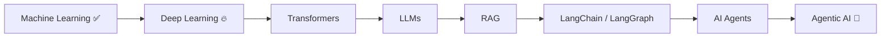

<div align="center">


<br>

### `AI Diploma Student` • `ML Enthusiast` • `Deep Learning Learner` • `Python Developer`

<sub>Building my way from Machine Learning → Deep Learning → Generative AI → Agentic AI</sub>

<br><br>

<a href="https://linkedin.com/in/YOUR_LINKEDIN_USERNAME">

</a>
&nbsp;
<a href="https://instagram.com/ayush._.ahirrao_23">

</a>
&nbsp;
<a href="https://x.com/ahirrao6113">

</a>
&nbsp;
<a href="mailto:ayushahirrao4@gmail.com">

</a>

<br><br>


</div>

<br>

---

## 🧑‍💻 `whoami`

```python
class AyushAhirrao:
    def __init__(self):
        self.education = "Diploma in Artificial Intelligence 🎓"
        self.location = "India 🇮🇳"

        self.interests = [
            "Machine Learning",
            "Deep Learning",
            "Generative AI",
            "Agentic AI",
            "LLMs"
        ]

        self.currently_learning = [
            "Neural Networks",
            "TensorFlow",
            "PyTorch"
        ]

        self.next_up = [
            "Transformers",
            "RAG",
            "LangChain",
            "AI Agents"
        ]

        self.goal = "AI/ML Engineer 🚀"

    def philosophy(self):
        return "Learn → Build → Break → Debug → Improve → Repeat 🔁"
```

<div align="center">

### 🧠 My AI Journey

`Python` → `Data Science` → `Machine Learning` → `Deep Learning` → `Transformers` → `RAG` → `LLMs` → `Agentic AI`

</div>

---

## ⚡ What I'm Doing Right Now

<table>
<tr>
<td width="50%" valign="top">

### 🔭 Building

Real-world **Machine Learning & Deep Learning projects** focused on turning concepts into working applications.

Experimenting with neural networks, model training, APIs and AI-powered applications.

</td>
<td width="50%" valign="top">

### 🌱 Learning

🧠 Neural Networks
🔥 TensorFlow & PyTorch
⚡ Deep Learning architectures
🤖 Generative AI
🔗 RAG & LLM systems
🕸️ Agentic AI

</td>
</tr>
</table>

---

# 🚀 Featured Projects

<table>
<tr>
<td width="50%" valign="top">

### ⛽ FuelSync

**Smart Fuel Station Finder**

A location-based application for discovering nearby fuel, CNG and EV charging stations.

**Built with**

`Firebase` `Maps` `JavaScript` `APIs`

> 🌍 Turning location data into a practical real-world utility.

</td>

<td width="50%" valign="top">

### 📉 Startup Shutdown Risk Predictor

**Machine Learning Risk Analysis System**

Predicts startup shutdown risk using founder, business and operational indicators.

**Built with**

`Python` `Pandas` `Scikit-Learn` `ML`

> 🧠 Applying machine learning to business-risk prediction.

</td>
</tr>

<tr>
<td width="50%" valign="top">

### 🤖 INGRES AI Chatbot

**AI-powered Groundwater Assistant**

Conversational AI system designed to assist with groundwater resource estimation and related information.

**Built with**

`Python` `AI APIs` `LLMs` `Backend`

> 💧 Connecting conversational AI with real-world resource analysis.

</td>

<td width="50%" valign="top">

### 🧠 Neural Network Lab

**Deep Learning Experiments**

Experiments with neural networks including ANN, CNN, RNN and other deep-learning concepts.

**Built with**

`TensorFlow` `PyTorch` `Python`

> ⚡ Learning deep learning by actually building models.

</td>
</tr>
</table>

---

# 🛠️ Tech Arsenal

<div align="center">

### 👨‍💻 Languages


<br><br>

### 🧠 AI • Machine Learning • Deep Learning


&nbsp;


<br><br>

### ⚙️ Backend & Databases


<br><br>

### ☁️ Cloud & Deployment


<br><br>

### 🔧 Developer Tools


</div>

---

# 🧬 AI Skill Matrix

```text
Machine Learning     ███████████████████░   Building
Deep Learning        ██████████████░░░░░░   Learning
TensorFlow           █████████████░░░░░░░   Learning
PyTorch              ███████████░░░░░░░░░   Learning
Generative AI        ███████░░░░░░░░░░░░░   Exploring
RAG                   ████░░░░░░░░░░░░░░░░   Next
Agentic AI           ███░░░░░░░░░░░░░░░░░   Next
```

> The bars represent my current learning journey — not fake proficiency percentages.

---

# 📊 GitHub Intelligence

<div align="center">


<br>


</div>

---

# 📈 Contribution Activity

<div align="center">


</div>

---

# 🏆 GitHub Achievements

<div align="center">


</div>

---

## 🎯 Current Roadmap



---

## 💡 Developer Mindset

<div align="center">

```text
┌──────────────────────────────────────────────────────────┐
│                                                          │
│   I don't want to just use AI.                           │
│   I want to understand how it works,                     │
│   build systems with it, and solve real problems.        │
│                                                          │
└──────────────────────────────────────────────────────────┘
```

</div>

---

<div align="center">

### 🤝 Let's Connect & Build Something Interesting

I'm always interested in **AI, Machine Learning, Deep Learning and intelligent systems.**

<br>

<a href="mailto:ayushahirrao4@gmail.com">

</a>

<br><br>

### `while(alive) { learn(); build(); improve(); }`

<br>


</div>
