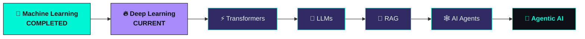

<div align="center">


<br/>

`Diploma in Artificial Intelligence`&nbsp;&nbsp;•&nbsp;&nbsp;`AI / ML Developer`&nbsp;&nbsp;•&nbsp;&nbsp;`India 🇮🇳`

<br/>

[](https://linkedin.com/in/ayush-ahirrao-548942369/)
[](https://instagram.com/ayush._.ahirrao_23)
[](https://x.com/ahirrao6113)
[](mailto:ayushahirrao4@gmail.com)


</div>

<br/>


<br/>

## &nbsp;🧬&nbsp; About Me

<table width="100%">
<tr>
<td width="60%" valign="top">

```yaml
engineer:
  name: Ayush Ahirrao
  education: Diploma in Artificial Intelligence
  role: AI / ML Developer
  based_in: India

  belief: >
    I don't want to just call an API and call
    myself an AI engineer — I want to understand
    the systems underneath: how models learn,
    how networks represent knowledge, how agents
    reason and act.

  currently:
    - Deepening Deep Learning fundamentals
    - Building real-world ML systems end-to-end
    - Preparing for Transformers → LLMs → RAG

  destination: Agentic AI
```

</td>
<td width="40%" valign="top" align="center">

**Focus Radar**

| Track | Status |
|:--|:--:|
| Machine Learning | ✅ Solid |
| Deep Learning | 🔥 Active |
| Generative AI | 🔜 Next |
| Agentic AI | 🎯 Destination |

</td>
</tr>
</table>

<br/>


<br/>

## &nbsp;🛤️&nbsp; The Learning Path

<div align="center">

```
  PYTHON ──▶ DATA SCIENCE ──▶ MACHINE LEARNING ──▶ DEEP LEARNING
                                                          │
     ┌────────────────────────────────────────────────────┘
     ▼
  TRANSFORMERS ──▶ LLMs ──▶ RAG ──▶ AI AGENTS ──▶ 🚀 AGENTIC AI
```

| Stage | Progress |
|:--|:--|
| Python | `██████████████████░░` 90% |
| Machine Learning | `█████████████████░░░` 85% |
| Deep Learning | `████████████░░░░░░░░` 60% |
| Transformers | `████░░░░░░░░░░░░░░░░` 20% |
| LLM Engineering | `███░░░░░░░░░░░░░░░░░` 15% |
| RAG | `██░░░░░░░░░░░░░░░░░░` 10% |
| Agentic AI | `██░░░░░░░░░░░░░░░░░░` 10% |

</div>

<br/>


<br/>

## &nbsp;🛠️&nbsp; What I'm Doing Right Now

<table width="100%">
<tr>
<td width="33%" align="center" valign="top">

### 🧠&nbsp; Learning
Deep Learning
Neural Networks
TensorFlow
PyTorch

</td>
<td width="33%" align="center" valign="top">

### 🔨&nbsp; Building
ML Systems
AI Applications
Backend APIs
Neural Networks

</td>
<td width="33%" align="center" valign="top">

### 🔮&nbsp; Next Up
Transformers
LLMs
RAG
AI Agents

</td>
</tr>
</table>

<br/>


<br/>

## &nbsp;🚀&nbsp; Featured Builds

<sub>Things I've actually shipped — not tutorial graveyards.</sub>

<table width="100%">
<tr>
<td width="50%" valign="top">

### 🚦 Smart Accident Risk Predictor
`Machine Learning · Risk Prediction`

Predicts accident risk and severity from road and environmental conditions using supervised ML models.

**[→ View Repository](https://github.com/ayushahirrao2007/Smart_Accident_Risk_Predictor)**

</td>
<td width="50%" valign="top">

### 📉 Startup Failure Prediction
`Machine Learning · Risk Modeling`

Predicts startup failure and shutdown risk from founder and startup-level indicators.

**[→ View Repository](https://github.com/ayushahirrao2007/Startup-Failure_prediction)**

</td>
</tr>
<tr>
<td width="50%" valign="top">

### ⛽ FuelSync
`Location Intelligence`

Finds nearby Petrol, CNG, and EV charging stations using real-world location data.

**[→ View Repository](https://github.com/ayushahirrao2007/FuelSync)**

</td>
<td width="50%" valign="top">

### 🧠 Stroke Awareness Platform
`Healthcare · Education`

An educational web platform for stroke awareness, learning resources, and therapeutic information.

**[→ View Repository](https://github.com/ayushahirrao2007/Stroke_WebsiteMain)**

</td>
</tr>
</table>

<br/>


<br/>

## &nbsp;🧰&nbsp; Tech Stack

<div align="center">

**Languages**
<br/>


<br/><br/>

**AI / Deep Learning**
<br/>

<br/>


<br/><br/>

**Backend / Data**
<br/>


<br/><br/>

**Cloud**
<br/>


<br/><br/>

**Tools**
<br/>


</div>

<br/>


<br/>

## &nbsp;📊&nbsp; GitHub Stats

<div align="center">


<br/><br/>


<br/><br/>


</div>

<br/>


<br/>

## &nbsp;🏆&nbsp; Trophy Case

<div align="center">


</div>

<br/>


<br/>

## &nbsp;🗺️&nbsp; Roadmap



<br/>


<br/>

## &nbsp;💭&nbsp; Why AI

<div align="center">

*I don't want to simply call an AI API and call myself an AI engineer.*
*I want to understand the systems underneath it —*
*how models learn, how neural networks represent information,*
*how LLM applications retrieve knowledge,*
*how agents reason, use tools, and execute tasks.*

*Then, I want to build systems that are actually useful.*

**— Ayush**

</div>

<br/>

```js
while (alive) {
  learn();
  build();
  fail();
  debug();
  improve();
}
```

<br/>

<div align="center">

## &nbsp;📡&nbsp; Let's Build Something

Got an interesting AI idea? Let's build something that shouldn't exist yet.

[](mailto:ayushahirrao4@gmail.com)

<br/><br/>

**SYSTEM STATUS: ONLINE 🟢**


</div>
